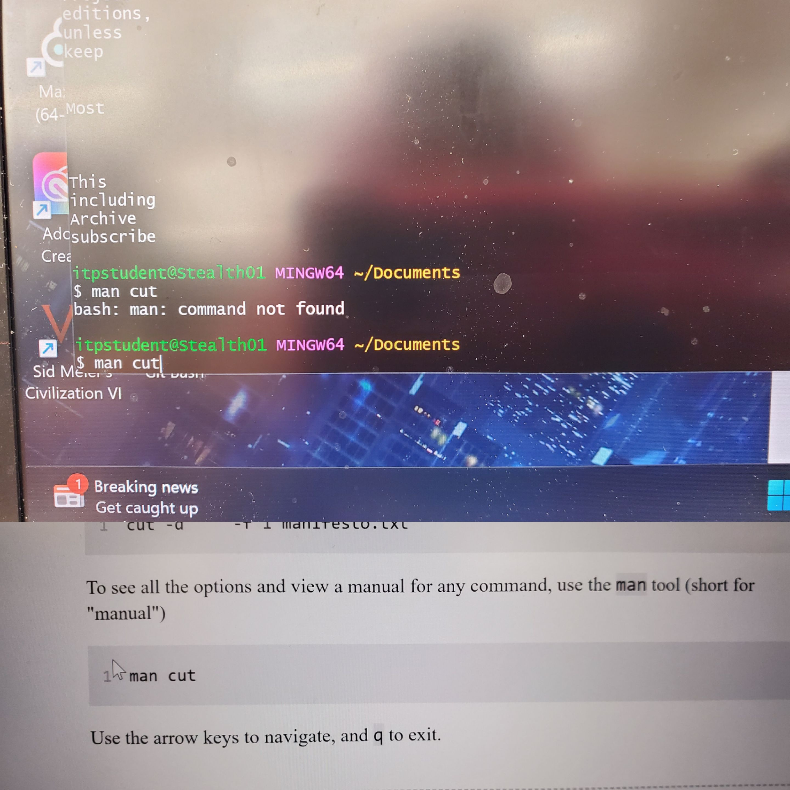
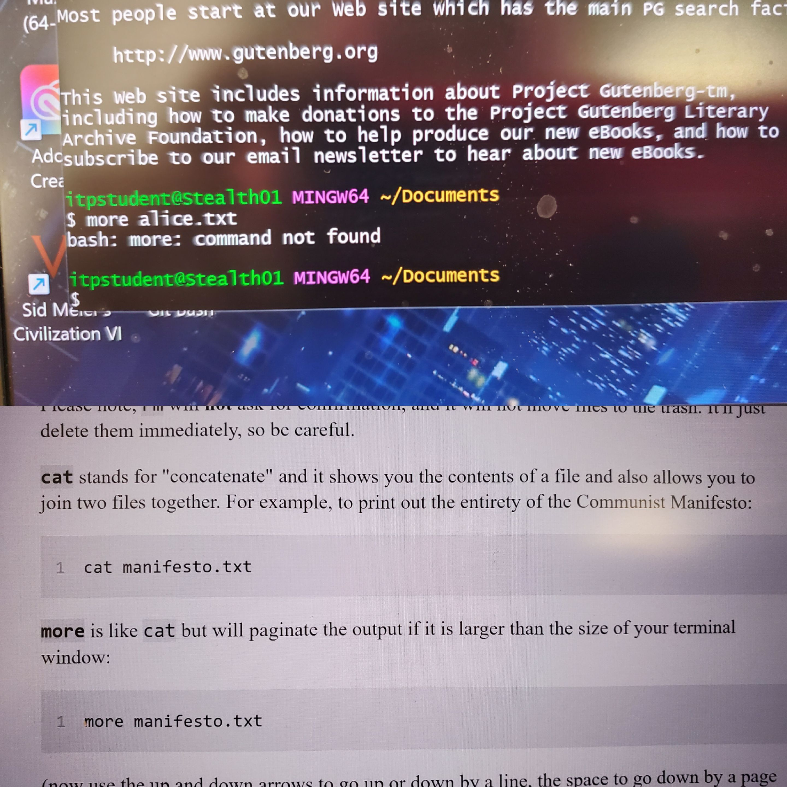
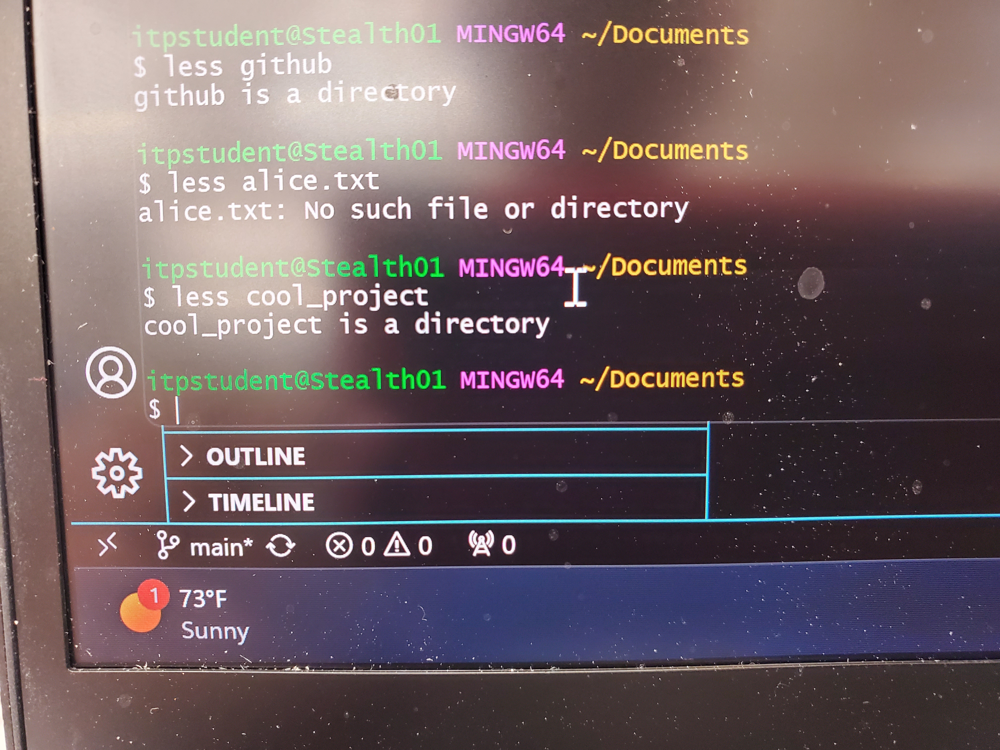

# 05-reading
 
I used Git for Windows for this exercise and for the most part it works though ther seems to be some commands that don't work.

The manual function didn't work 
 

Neither did the more function
 

# Using ChatGPT
I asked ChatGPT for details on the situation and this is the answer I got: 

"It sounds like you're using Git Bash, which is a command-line interface for Git on Windows. While Git Bash provides a Unix-like environment, it may not include all the Unix/Linux commands you'd find on a full Linux distribution like Ubuntu.

For the `more` and `man` commands, these are standard commands in Unix-like systems like Ubuntu, but they may not be included in Git Bash.

If you're looking for a way to view the contents of a file page by page (similar to `more`), you can use the `less` command, which is a more versatile and commonly available command. To use it, simply type:

```bash
less filename
```

You can navigate through the file using arrow keys, and press "q" to exit `less`.

As for the `man` command, it's typically used to display manual pages for other commands and utilities. In Git Bash, you might not have access to manual pages in the same way you would in a full Linux distribution. However, you can often find manual pages for Unix commands online by searching for them in your web browser.

If you're working with Git Bash and need to learn about specific commands or utilities, you can often find documentation online or by searching for the command's name followed by "manual" in a search engine.

Keep in mind that Git Bash is a minimalistic Unix-like environment primarily designed for working with Git. If you need a more complete Unix-like experience, you might consider using Windows Subsystem for Linux (WSL), which allows you to run a full Linux distribution like Ubuntu alongside Windows. This would give you access to all the standard Unix commands and utilities." 


# Conclusion
I've tried out the command, less, and it seems to work find. As I expected, Git for Windows wouldn't have all the Linux commands like Ubuntu. Though, for the most part, I was able to get through the rest of the tutorial and use it just fine. 
